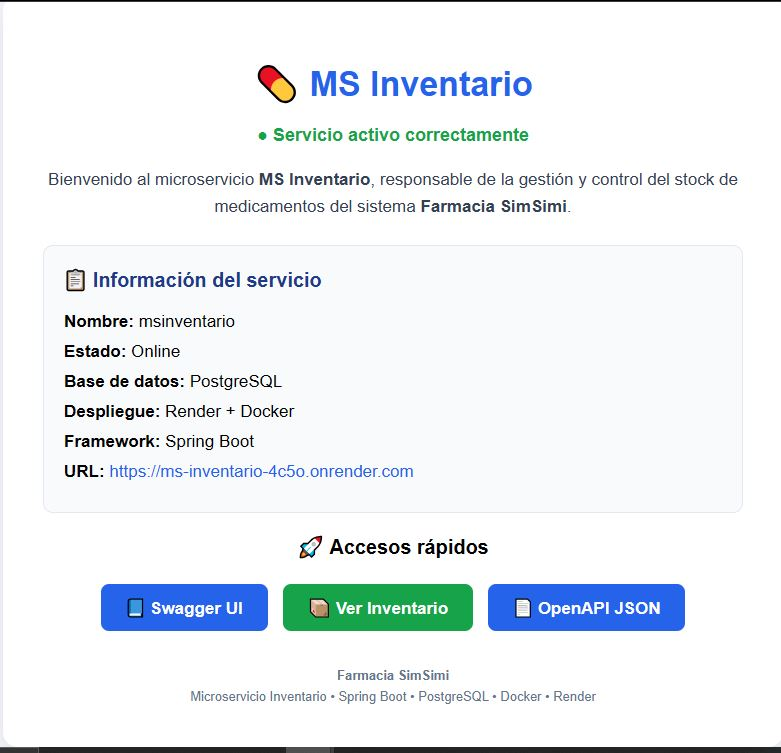
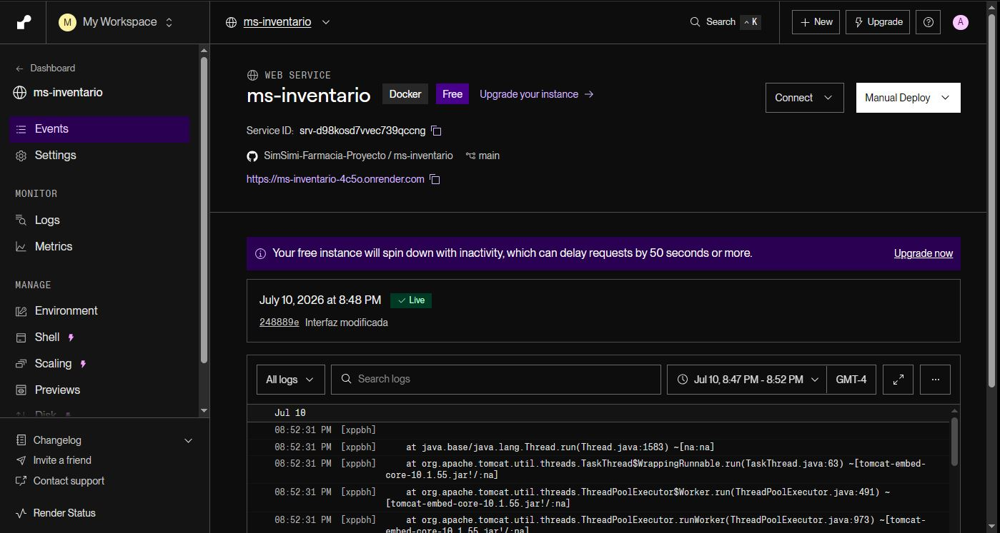
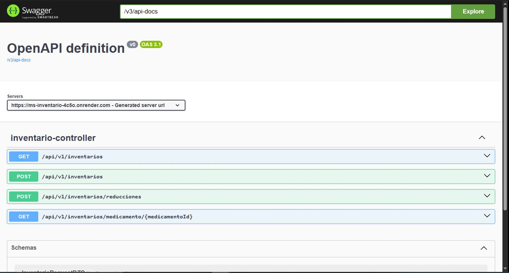

# 💊 Farmacia-SimSimi

Sistema de gestión de farmacia basado en una arquitectura de microservicios desarrollada con Spring Boot.

El proyecto permite administrar clientes, medicamentos, ventas, pagos, recetas, inventario y otros procesos asociados a una farmacia mediante servicios independientes comunicados a través de APIs REST.

---

# 📌 Microservicio: MS Inventario

`msinventario` es el microservicio encargado de administrar el stock disponible de medicamentos.

Sus principales responsabilidades son:

- Registrar inventario de medicamentos.
- Consultar stock disponible.
- Buscar inventario asociado a un medicamento.
- Actualizar cantidades mediante reducción de stock.
- Validar operaciones para evitar cantidades inválidas.
- Manejar errores mediante excepciones personalizadas.
- Exponer una API REST documentada mediante Swagger.
- Ejecutarse como servicio independiente desplegado en la nube.

---

# 🏗️ Arquitectura general del sistema

El sistema Farmacia-SimSimi está compuesto por múltiples microservicios independientes.

Cada microservicio posee:

- Su propia lógica de negocio.
- Sus propios controladores.
- Sus servicios.
- Sus repositorios.
- Su propia persistencia.

El microservicio `msinventario` funciona de manera independiente y puede comunicarse con otros servicios del sistema mediante APIs REST.

Arquitectura general:

```
                  Cliente / Frontend
                         |
                         |
                         ▼
                API REST Farmacia
                         |
        ┌────────────────┼────────────────┐
        │                │                │
        ▼                ▼                ▼

   mscliente       msmedicamentos     msinventario
      |                 |                 |
      |                 |                 |
      ▼                 ▼                 ▼

  Base datos        Base datos       Base datos
  clientes        medicamentos      inventario
```

---

# ⚙️ Tecnologías utilizadas

| Tecnología | Uso |
|---|---|
| Java 21 | Lenguaje principal |
| Spring Boot 3.5.16 | Framework backend |
| Spring Web | Desarrollo API REST |
| Spring Data JPA | Persistencia de datos |
| Hibernate | ORM |
| PostgreSQL | Base de datos principal |
| Lombok | Reducción de código repetitivo |
| Jakarta Validation | Validación de datos |
| SpringDoc OpenAPI | Documentación Swagger |
| Maven | Gestión de dependencias |
| Docker | Contenedorización |
| Render | Despliegue cloud |

---

# 📂 Estructura del proyecto

```
msinventario

src/main/java/com/farmacia/msinventario

├── config
│
├── controller
│
├── dto
│   ├── request
│   ├── response
│   └── stock
│
├── exception
│
├── mapper
│
├── model
│
├── repository
│
├── service
│   ├── interfaces
│   └── impl
│
└── MsinventarioApplication.java
```

---

# 🔄 Arquitectura interna del microservicio

El flujo interno sigue una arquitectura por capas:

```
          Cliente HTTP
               |
               ▼

     InventarioController

               |
               ▼

       InventarioService

               |
               ▼

     InventarioRepository

               |
               ▼

          PostgreSQL
```

---

# 🗄️ Base de datos

Motor utilizado:

```
PostgreSQL
```

Base de datos:

```
db_ms_inventario
```

Entidad principal:

```
Inventario
```

Campos:

| Campo | Tipo | Descripción |
|---|---|---|
| id | Long | Identificador del inventario |
| medicamentoId | Long | Identificador del medicamento |
| cantidad | Integer | Stock disponible |
| actualizadoEn | LocalDateTime | Última actualización |

La aplicación utiliza:

- Spring Data JPA.
- Hibernate.
- Persistencia mediante PostgreSQL.
- Relaciones mediante identificadores entre microservicios.

---

# 🚀 Ejecución local

## Requisitos previos

Instalar:

- Java 21.
- Maven.
- PostgreSQL.
- Git.

También es posible ejecutar mediante Docker.

---

## Configuración de variables de entorno

Crear:

```
DB_URL
DB_USER
DB_PASSWORD
```

Ejemplo:

```
DB_URL=jdbc:postgresql://localhost:5432/db_ms_inventario
DB_USER=postgres
DB_PASSWORD=password
```

---

## Ejecutar aplicación

Con Maven:

```
./mvnw spring-boot:run
```

La aplicación utiliza:

```
http://localhost:8080
```

---

# 🐳 Ejecución con Docker

El proyecto utiliza un Dockerfile para construir la imagen del microservicio.

Crear imagen:

```
docker build -t msinventario .
```

Ejecutar contenedor:

```
docker run -p 8080:8080 msinventario
```

La aplicación quedará disponible en:

```
http://localhost:8080
```

---

# 🌎 Despliegue en Render

El microservicio se encuentra desplegado como:

```
Web Service
```

en Render utilizando Docker.

Arquitectura del despliegue:

```
Código fuente

        |

        ▼

     Dockerfile

        |

        ▼

 Render Web Service

        |

        ▼

 PostgreSQL Render
```

Características del despliegue:

- Servicio independiente.
- Base de datos PostgreSQL en Render.
- Variables de entorno configuradas.
- Puerto dinámico mediante Render.
- Sin dependencia de Eureka.

---

# 🌐 URL Producción

Aplicación:

```
https://ms-inventario-4c5o.onrender.com
```

Swagger:

```
https://ms-inventario-4c5o.onrender.com/swagger-ui/index.html
```

OpenAPI:

```
https://ms-inventario-4c5o.onrender.com/v3/api-docs
```

---

# 📖 Documentación Swagger

Swagger permite probar los endpoints directamente desde el navegador.

Disponible en:

```
/swagger-ui/index.html
```

Incluye:

- Modelos DTO.
- Métodos HTTP disponibles.
- Ejemplos de solicitudes.
- Respuestas esperadas.

---

# 🔌 Endpoints disponibles

## Obtener inventario completo

```
GET /api/v1/inventarios
```

Respuesta ejemplo:

```json
[
 {
  "id":1,
  "medicamentoId":1,
  "cantidad":90
 }
]
```

---

## Crear inventario

```
POST /api/v1/inventarios
```

Ejemplo:

```json
{
 "medicamentoId":4,
 "cantidad":80
}
```

---

## Buscar por medicamento

```
GET /api/v1/inventarios/medicamento/{medicamentoId}
```

Ejemplo:

```
GET /api/v1/inventarios/medicamento/1
```

---

## Reducir stock

```
POST /api/v1/inventarios/reducciones
```

Ejemplo:

```json
{
 "medicamentoId":1,
 "cantidad":10
}
```

---

# 🧪 Datos iniciales

Al iniciar la aplicación se cargan registros de prueba mediante `CommandLineRunner`.

Datos iniciales:

| ID | Medicamento ID | Cantidad |
|---|---|---|
| 1 | 1 | 90 |
| 2 | 2 | 50 |
| 3 | 3 | 200 |
| 4 | 4 | 80 |

---

# ⚠️ Manejo de errores

El microservicio implementa:

- `@RestControllerAdvice`.
- Excepciones personalizadas.
- Respuestas HTTP controladas.

Excepciones:

```
ResourceNotFoundException
StockInsuficienteException
```

---

# ✅ Validaciones implementadas

Los DTO utilizan Jakarta Validation:

```
@NotNull
@Min
```

Permite controlar:

- Datos obligatorios.
- Cantidades negativas.
- Solicitudes inválidas.

---

# 📝 Variables de entorno en Render

Configuradas desde:

```
Render Dashboard
→ Environment Variables
```

Variables utilizadas:

| Variable | Descripción |
|---|---|
| DB_URL | URL PostgreSQL |
| DB_USER | Usuario PostgreSQL |
| DB_PASSWORD | Contraseña PostgreSQL |

---

# 👩‍💻 Autor

Proyecto desarrollado como parte de la carrera Ingeniería en Informática.

Microservicio:

```
msinventario
```

## 📸 Evidencias del despliegue

### Página principal del microservicio



### Despliegue en Render



### Documentación Swagger




Sistema:

```
Farmacia-SimSimi
```